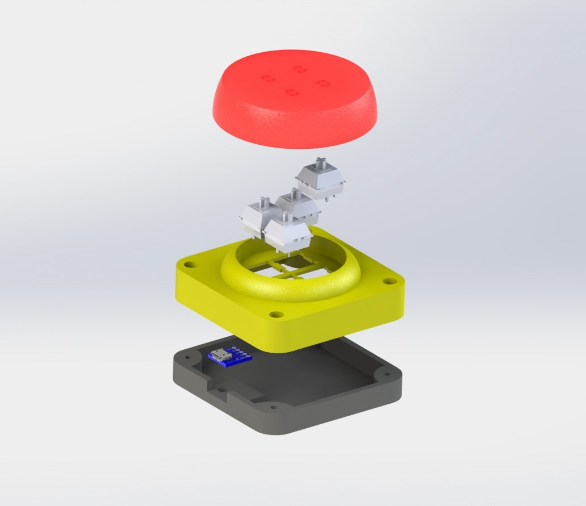
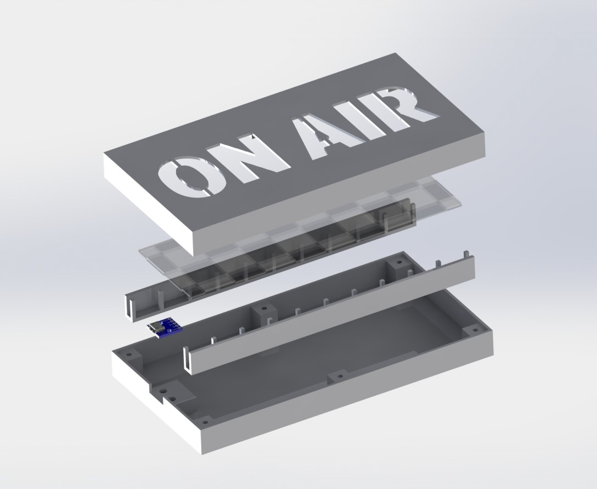

# OnAir-Sign
433MHz operated On Air sign for a music studio or a Radio Station to signal that music production is in porgress. 
This project consits of two Arduinos (Pro Mini, Nano or similar), LED Strips and the communication Modul HC-12. 

## Functional principle

With a press on the button a ON signal is send to the sign. The sign then turns on the LEDs and sends an acknowledgment back to the button. If the button receives the confirmation it will turn on its LEDs. The key ignores all key presses in a period of 800ms from the first press. 

Possible improvememts:
* debounce for button
* no acknowledgment after button press, resend the signal
* handle the state of LEDs more efficent
* button ignore period interconnect with the acknowledgment signal

## Materials
* 2x Arduino Nano (alternativ Pro Mini or similar)
* 4x Cherry MX switches
* 2x  HC-12 Module
* LEDs (all LEDs supported by the [FastLED](https://github.com/FastLED/FastLED) Library are possible)
  * Strip WS2812b 
  * Circle PCB WS2812b
* 2x Capacitor 22 µF to 1 mF
* 2x Micro USB breakout board (for reference something like [that](https://www.ebay.com/itm/5Pcs-Micro-USB-Board-Power-Adapter-5V-Breakout-Switch-Interface-Module-F-Arduino/153733325920?hash=item23cb386460:g:TX4AAOSwbb5d1qM8) of ebay)
* M3 inseters
* screws

## Result

## Button

## Sign

## Installation

1. Wire the components according to the schematics for the button and the sign
1. Print the STL files for the sign and the button
1. Assemble the button and the sign according the explosion picture
1. Flash the arduinos with the arduino IDE

The code is "copy and paste" quality. 

## Remixed from

* [Big Emergency / Panic Button for MySensors / pimatic](https://www.thingiverse.com/thing:1406545) by MaxWinterstein is licensed under the [Creative Commons](http://creativecommons.org/licenses/by/3.0/) - Attribution license via [thingiverse](https://www.thingiverse.com/)
* [On Air Sign](https://www.thingiverse.com/thing:2847029) by klein0r is licensed under the [Creative Commons](http://creativecommons.org/licenses/by/3.0/) - Attribution license via [thingiverse](https://www.thingiverse.com/)
* Tutorial [Arduino and HC-12 Long Range Wireless Communication Module](https://howtomechatronics.com/tutorials/arduino/arduino-and-hc-12-long-range-wireless-communication-module/) by Dejan via [howtomechatronics](https://howtomechatronics.com/)
* [Micro USB DIP 5-Pin Pinboard 2,54mm](https://grabcad.com/library/micro-usb-dip-5-pin-pinboard-2-54mm-1) by Conrad Bannik via [grabcad](https://grabcad.com/)
* [Cherry MX switch](https://grabcad.com/library/cherry-mx-switch-2) by Gal Pavlin via [grabcad](https://grabcad.com/)
* [FastLED](https://github.com/FastLED/FastLED) by [FastLED.io](http://fastled.io/) under the [MIT](https://opensource.org/licenses/mit-license.php) license.
